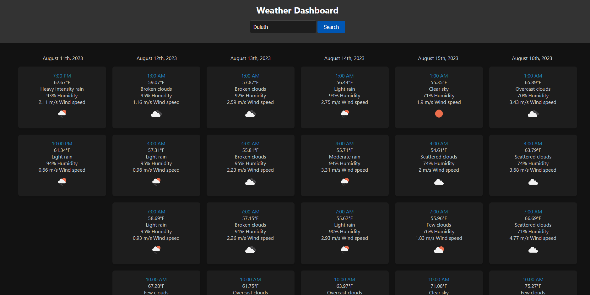

# Weather Forecast App

## Description

The Weather Forecast App is a simple web application that allows users to search for weather forecasts for different cities around the world. The app displays the temperature, weather conditions, humidity, wind speed, and an icon representing the weather for the upcoming days.

## Features

- User-friendly interface.
- Search for weather forecasts by city name.
- Displays temperature in Fahrenheit.
- Shows weather conditions with icons.
- Provides humidity and wind speed information.
- Stores the last searched city in local storage for easy retrieval.

## Technologies Used

- HTML
- CSS
- JavaScript
- OpenWeatherMap API

## How to Use

1. Enter the name of a city in the input field.
2. Click the "Search" button to fetch the weather forecast.
3. The app will display the weather forecast for the next few days, including temperature, weather conditions, humidity, and wind speed.
4. The app will also show an icon representing the weather conditions for each day.

## Installation

1. Clone the repository: `git clone https://github.com/yourusername/weather-forecast-app.git`
2. Open the `index.html` file in a web browser.

OR

1. Use the provided GitHub Pages link.

## Credits

- Weather data provided by the [OpenWeatherMap API](https://openweathermap.org/).
- Icons used for weather conditions are from OpenWeatherMap's [Weather icons](https://openweathermap.org/weather-conditions) library.

## License

This project is licensed under the [MIT License](LICENSE).